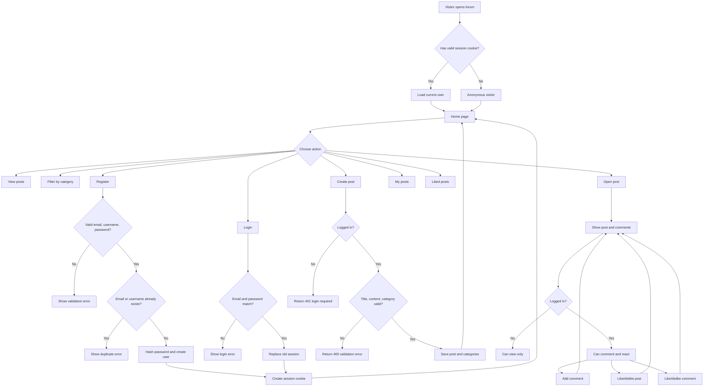
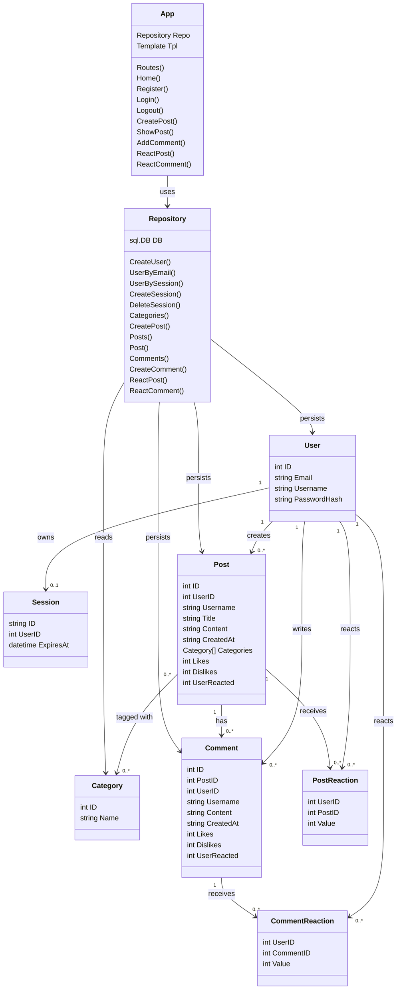

# Forum

A small web forum built with Go, SQLite, server-side HTML templates, and Docker.

The application supports user registration and login, sessions, post creation, comments, categories, likes/dislikes, and filtered post views.

## Features

- Register with email, username, and password.
- Login/logout with HTTP-only session cookies.
- Login with GitHub or Google.
- One active session per user.
- Password hashing with bcrypt.
- Create posts with one or more categories.
- Attach PNG, JPEG, or GIF images to posts.
- Add comments to posts.
- Like, dislike, or clear reactions on posts and comments.
- Browse all posts, posts by category, your own posts, and your liked posts.
- SQLite database with automatic schema creation.
- Dockerfile, Docker Compose config, and helper scripts for containerized runs.
- Unit/integration tests for auth, database, repository, and handlers.

## Tech Stack

- Go 1.22
- SQLite
- `github.com/mattn/go-sqlite3`
- `github.com/gofrs/uuid/v5`
- `golang.org/x/crypto/bcrypt`
- Docker

## Project Structure

```text
.
+-- cmd/server/main.go          # Application entry point
+-- internal/auth               # Password hashing and validation helpers
+-- internal/db                 # SQLite opening and schema loading
+-- internal/handlers           # HTTP routes and handlers
+-- internal/models             # Shared application structs
+-- internal/repository         # Database queries and persistence logic
+-- migrations/schema.sql       # SQLite schema and default categories
+-- static/css/style.css        # Styling
+-- templates                   # HTML templates used by the app
+-- Dockerfile                  # Docker image definition
+-- docker-compose.yml          # Compose configuration
+-- docker-run.ps1              # PowerShell Docker automation script
+-- docker-run.sh               # Unix shell Docker automation script
```

## Requirements

For local development:

- Go 1.22+
- SQLite driver dependencies supported by your system

For Docker:

- Docker Desktop or Docker Engine

## Local Run

Install modules and start the server:

```bash
go mod tidy
go run ./cmd/server
```

Open:

```text
http://localhost:8080
```

By default, the app uses:

```text
DB_PATH=./forum.db
SCHEMA_PATH=migrations/schema.sql
```

GitHub and Google login work in local fallback mode when OAuth credentials are not configured. For real provider OAuth, set:

```text
APP_URL=http://localhost:8080
GITHUB_CLIENT_ID=...
GITHUB_CLIENT_SECRET=...
GOOGLE_CLIENT_ID=...
GOOGLE_CLIENT_SECRET=...
```

You can override them:

```bash
DB_PATH=./data/forum.db SCHEMA_PATH=migrations/schema.sql go run ./cmd/server
```

PowerShell example:

```powershell
$env:DB_PATH=".\data\forum.db"
$env:SCHEMA_PATH="migrations\schema.sql"
go run ./cmd/server
```

## Docker Run

### PowerShell

If script execution is allowed:

```powershell
.\docker-run.ps1
```

If script execution is blocked by Windows policy:

```powershell
powershell -ExecutionPolicy Bypass -File .\docker-run.ps1
```

Optional parameters:

```powershell
powershell -ExecutionPolicy Bypass -File .\docker-run.ps1 -ContainerName forum -Port 8080
```

### Unix Shell

```bash
sh ./docker-run.sh
```

Optional environment variables:

```bash
CONTAINER_NAME=forum PORT=8080 IMAGE_NAME=forum:latest sh ./docker-run.sh
```

Both scripts:

- build `forum:latest`
- create `data/` if missing
- remove an old container with the same name
- run the app on port `8080`
- mount `./data:/app/data`
- set `DB_PATH=data/forum.db`
- set `SCHEMA_PATH=migrations/schema.sql`
- set `UPLOAD_DIR=data/uploads`
- set `UPLOAD_URL_PREFIX=/uploads`

## Docker Compose

```bash
docker compose up --build
```

The Compose file also mounts the SQLite database into `./data`.

## Tests

Run all tests:

```bash
go test ./...
```

The tests cover:

- password hashing and validation
- database opening and schema loading
- repository operations
- registration and login
- duplicate users
- sessions
- post/comment creation
- reactions
- filters
- HTTP status behavior

## Database

The schema is defined in [migrations/schema.sql](migrations/schema.sql).

Main tables:

- `users`
- `sessions`
- `categories`
- `posts`
- `post_categories`
- `comments`
- `post_reactions`
- `comment_reactions`

Post images are stored on disk and their public path is saved in `posts.image_path`.

Default categories are inserted automatically:

- General
- Technology
- Science
- Sports
- Entertainment

Example SQLite queries:

```sql
SELECT * FROM users;
SELECT * FROM posts;
SELECT * FROM comments;
```

Passwords are stored in `users.password_hash` as bcrypt hashes, not plain text.

## Application Flowchart



## UML Class Diagram



## HTTP Routes

| Method | Path | Description |
| --- | --- | --- |
| `GET` | `/` | Home page and post list |
| `GET` | `/?category={id}` | Filter posts by category |
| `GET` | `/?type=created` | Current user's posts |
| `GET` | `/?type=liked` | Current user's liked posts |
| `GET` | `/register` | Registration form |
| `POST` | `/register` | Create user |
| `GET` | `/login` | Login form |
| `POST` | `/login` | Authenticate user |
| `GET` | `/auth/github` | GitHub login |
| `GET` | `/auth/google` | Google login |
| `GET` | `/auth/github/callback` | GitHub OAuth callback |
| `GET` | `/auth/google/callback` | Google OAuth callback |
| `POST` | `/logout` | Logout |
| `GET` | `/post/create` | Create post form |
| `POST` | `/post/create` | Save post |
| `GET` | `/uploads/{file}` | Serve uploaded Docker images |
| `GET` | `/post/{id}` | Show post and comments |
| `POST` | `/post/{id}/comment` | Add comment |
| `POST` | `/post/{id}/react` | Like, dislike, or clear post reaction |
| `POST` | `/comment/{id}/react` | Like, dislike, or clear comment reaction |

## Notes

- Anonymous users can read posts and comments.
- Only logged-in users can create posts, comment, or react.
- The project supports three authentication methods: email/password, GitHub, and Google.
- Reactions use one row per user and target, so a user cannot like and dislike the same item at the same time.
- Creating a new session for a user removes their previous session.
